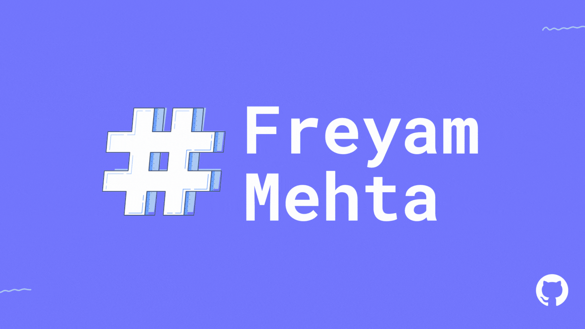

## Hello, folks! 

 

### - 🔭 I’m currently working on **C/C++/Python and Front End Development**.
### - 🌱 I’m currently learning how to create **Fluid Animations using CSS**.
### - 💕 I love **Solving Problems and Playing around with Computer Softwares**.
### - 💻 I want to **Contribute to the Open Source Community**.

 

